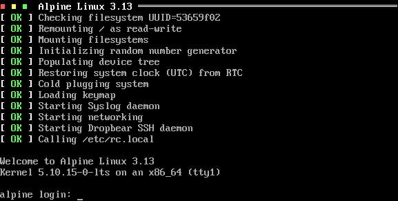

[![License Badge][]][License] [![GitHub Status]][GitHub] [![Coverity Status]][Coverity Scan]


* [Introduction](#introduction)
* [Features](#features)
* [Bootstrap](doc/bootstrap.md#bootstrap)
* [Runlevels](#runlevels)
* [Syntax](doc/config.md#syntax)
  * [Runparts & /etc/rc.local](#runparts--etcrclocal)
  * [Hooks, Callbacks & Plugins](doc/plugins.md#hooks-callbacks--plugins)
* [Rebooting & Halting](#rebooting--halting)
* [Commands & Status](#commands--status)
* [Tips & Tricks with the kernel cmdline](doc/cmdline.md)
* [Building](doc/build.md#building)
  * [Running](doc/build.md#running)
  * [Recovery](doc/build.md#recovery)
  * [Debugging](doc/build.md#debugging)
* [Requirements](#requirements)
* [Origin & References](#origin--references)


Introduction
------------

Fast init for Linux systems.  Reverse engineered from the [EeePC
fastinit][] over ten years ago by [Claudio Matsuoka][] — "gaps filled
with frog DNA …"

  
*Figure 1: Screenshot showing Finit booting [Alpine Linux](https://www.alpinelinux.org/).*

Features include:

  * Runlevels, defined per service
  * One-shot tasks, services (daemons), or [SysV init][4] start/stop scripts
  * Runparts and `/etc/rc.local` support
  * Process supervision similar to [systemd][]
  * Sourcing environment files
  * Conditions for network/process/custom dependencies
  * Pre/Post script actions
  * Tooling to enable/disable services
  * Built-in getty
  * Built-in watchdog, with support for hand-over to [watchdogd](https://troglobit.com/watchdogd.html)
  * Built-in support for Debian/BusyBox `/etc/network/interfaces`
  * Cgroups v2, both configuration and monitoring in `initctl top`
  * Plugin support for customization
  * Proper rescue mode with bundled `sulogin` for protected maintenance shell

Focus is on small and embedded systems, although Finit is fully usable
on server and desktop systems as well.  For working examples, see the
[contrib/](contrib/) section with tutorials for:

  * [Void Linux](contrib/void/),
  * [Alpine Linux](contrib/alpine/), and
  * [Debian GNU/Linux](contrib/debian/)


Example
-------

This example `/etc/finit.conf` can also be split up in multiple `.conf`
files in `/etc/finit.d`.  Available, but not yet enabled, services can
be placed in `/etc/finit.d/available` and enabled by an operator using
the [initctl](#commands--status) tool.

```ApacheConf
# Fallback if /etc/hostname is missing
host default

# Runlevel to start after bootstrap, 'S', default: 2
runlevel 2

# Max file size for each log file: 100 kiB, rotate max 4 copies:
# log => log.1 => log.2.gz => log.3.gz => log.4.gz
log size=100k count=4

# Services to be monitored and respawned as needed
service [S12345] env:-/etc/conf.d/watchdog watchdog $WATCHDOG_OPTS $WATCHDOG_DEV -- System watchdog daemon
service [S12345] env:-/etc/conf.d/syslog syslogd -n $SYSLOGD_OPTS          -- System log daemon
service [S12345] <pid/syslogd> env:-/etc/conf.d/klogd klogd -n $KLOGD_OPTS -- Kernel log daemon
service   [2345] env:-/etc/conf.d/lldpd lldpd -d $LLDPD_OPTS               -- LLDP daemon (IEEE 802.1ab)

# The BusyBox ntpd does not use syslog when running in the foreground
# So we use this trick to redirect stdout/stderr to a log file.  The
# log file is rotated with the above settings.  The condition declares
# a dependency on a system default route (gateway) to be set.  A single
# <!> at the beginning means ntpd does not respect SIGHUP for restart.
service [2345] log:/var/log/ntpd.log <!net/route/default> ntpd -n -l -I eth0 -- NTP daemon

# For multiple instances of the same service, add :ID somewhere between
# the service/run/task keyword and the command.
service :80   [2345] merecat -n -p 80   /var/www -- Web server
service :8080 [2345] merecat -n -p 8080 /var/www -- Old web server

# Alternative method instead of below runparts, can also use /etc/rc.local
#sysv [S] /etc/init.d/keyboard-setup       -- Setting up preliminary keymap
#sysv [S] /etc/init.d/acpid                -- Starting ACPI Daemon
#task [S] /etc/init.d/kbd                  -- Preparing console

# Run start scripts from this directory
# runparts /etc/start.d

# Virtual consoles run BusyBox getty, keep kernel default speed
tty [12345] /sbin/getty -L 0 /dev/tty1  linux nowait noclear
tty [2345]  /sbin/getty -L 0 /dev/tty2  linux nowait noclear
tty [2345]  /sbin/getty -L 0 /dev/tty3  linux nowait noclear

# Use built-in getty for serial port and USB serial
#tty [12345] /dev/ttyAMA0 noclear nowait
#tty [12345] /dev/ttyUSB0 noclear

# Just give me a shell, I need to debug this embedded system!
#tty [12345] console noclear nologin
```

The `service` stanza, as well as `task`, `run` and others are described
in full in [doc/config.md](doc/config.md).  Here's a quick overview of
some of the most common components needed to start a UNIX daemon:

```
service [LVLS] <COND> log env:[-]/etc/default/daemon daemon ARGS -- Daemon daemon
^       ^      ^      ^   ^                          ^      ^       ^
|       |      |      |   |                          |      |        `---------- Optional description
|       |      |      |   |                          |       `------------------ Daemon arguments
|       |      |      |   |                           `------------------------- Path to daemon
|       |      |      |    `---------------------------------------------------- Optional env. file
|       |      |       `-------------------------------------------------------- Redirect output to log
|       |       `--------------------------------------------------------------- Optional conditions
|        `---------------------------------------------------------------------- Optional Runlevels
 `------------------------------------------------------------------------------ Monitored application
```

Some components are optional: runlevel(s), condition(s) and description,
making it easy to create simple start scripts and still possible for more
advanced uses as well:

    service /usr/sbin/sshd -D

Dependencies are handled using [conditions](doc/conditions.md).  One of
the most common conditions is to wait for basic networking to become
available:

    service <net/route/default> nginx -- High performance HTTP server

Here is another example where we instruct Finit to not start BusyBox
`ntpd` until `syslogd` has started properly.  Finit waits for `syslogd`
to create its PID file, by default `/var/run/syslogd.pid`.

    service [2345] log <!pid/syslogd> ntpd -n -N -p pool.ntp.org
    service [S12345] syslogd -n -- Syslog daemon

Notice the `log` keyword, BusyBox `ntpd` uses `stderr` for logging when
run in the foreground.  With `log` Finit redirects `stdout` + `stderr`
to the system log daemon using the command line `logger(1)` tool.

A service, or task, can have multiple dependencies listed.  Here we wait
for *both* `syslogd` to have started and basic networking to be up:

    service [2345] log <pid/syslogd,net/route/default> ntpd -n -N -p pool.ntp.org

If either condition fails, e.g. loss of networking, `ntpd` is stopped
and as soon as it comes back up again `ntpd` is restarted automatically.

**Note:** Make sure daemons *do not* fork and detach themselves from the
  controlling TTY, usually an `-n` or `-f` flag, or `-D` as in the case
  of OpenSSH above.  If it detaches itself, Finit cannot monitor it and
  will instead try to restart it.


Features
--------

**Process Supervision**

Start, monitor and restart services should they fail.


**Getty**

Finit supports external getty but also comes with a limited built-in
Getty, useful for really small systems.  A getty sets up the TTY and
waits for user input before handing over to `/bin/login`, which is
responsible for handling the actual authentication.

```conf
tty [12345] /dev/tty1    nowait  linux
tty [12345] /dev/ttyAMA0 noclear vt100
tty [12345] /sbin/getty  -L /dev/ttyAMA0 vt100
```

Users of embedded systems may want to enable automatic serial console
with the special `@console` device.  This works regardless weather the
system uses `ttyS0`, `ttyAMA0`, `ttyMXC0`, or anything else.  Finit
figures it out by querying sysfs: `/sys/class/tty/console/active`.

```conf
tty [12345] @console linux noclear
```

Notice the optional `noclear`, `nowait`, and `nologin` flags.  The
latter is for skipping the login process entirely. For more information,
see [doc/config.md](doc/config.md#syntax).


**Runlevels**

Support for SysV init-style [runlevels][5] is available, in the same
minimal style as everything else in Finit.  The `[2345]` syntax can be
applied to service, task, run, and TTY stanzas.

Reserved runlevels are 0 and 6, halt and reboot, respectively just like
SysV init.  Runlevel 1 can be configured freely, but is recommended to
be kept as the system single-user runlevel since Finit will not start
networking here.  The configured `runlevel NUM` from `/etc/finit.conf`
is what Finit changes to after bootstrap, unless 'single' (or 'S') is
given on the kernel cmdline, in which case runlevel 1 is started.

All services in runlevel S(0) are started first, followed by the desired
run-time runlevel.  Run tasks in runlevel S can be started in sequence
by using `run [S] cmd`.  Changing runlevels at runtime is done like any
other init, e.g. <kbd>init 4</kbd>, but also using the more advanced
`intictl` tool.


**Plugins**

Plugins can *extend* the functionality of Finit and *hook into* the
different stages of the boot process and at runtime.  Plugins are
written in C and compiled into a dynamic library loaded automatically by
finit at boot.  A basic set of plugins are bundled in the `plugins/`
directory.

Capabilities:

- **Hooks**  
  Hook into the boot at predefined points to extend Finit
- **I/O**  
  Listen to external events and control Finit behavior/services

Extensions and functionality not purely related to what an `/sbin/init`
needs to start a system are available as a set of plugins that either
hook into the boot process or respond to various I/O.

For more information, see [doc/plugins.md](doc/plugins.md).


**Automatic Reload**

By default, Finit monitors `/etc/finit.d/` and `/etc/finit.d/enabled/`
registering any changes to `.conf` files.  To activate a change the user
must call `initctl reload`, which reloads all modified files, stops any
removed services, starts new ones, and restarts any modified ones.  If the
command line arguments of a service have changed, the process will be
terminated and then started again with the updated arguments. If the arguments
have not been modified and the process supports SIGHUP, the process will
receive a SIGHUP rather than being terminated and started.

For some use-cases the extra step of calling `initctl reload` creates an
unnecessary overhead, which can be removed at build-time using:

    configure --enable-auto-reload


**Cgroups**

Finit supports cgroups v2 and comes with the following default groups
in which services and user sessions are placed in:

     /sys/fs/cgroup
       |-- init/               # cpu.weight:100
       |-- system/             # cpu.weight:9800
       `-- user/               # cpu.weight:100

Finit itself and its helper scripts and services are placed in the
top-level leaf-node group `init/`, which also is _reserved_.

All run/task/service/sysv processes are placed in their own sub-group
in `system/`.  The name of each sub-group is taken from the respective
`.conf` file from `/etc/finit.d`.

All getty/tty processes are placed in their own sub-group in `user/`.
The name of each sub-group is taken from the username.

A fourth group also exists, the `root` group.  It is also _reserved_ and
primarily intended for RT tasks.  If you have RT tasks they need to be
declared as such in their service stanza like this:

    service [...] <...> cgroup.root /path/to/foo args -- description

or

    cgroup.root
    service [...] <...> /path/to/foo args -- description
    service [...] <...> /path/to/bar args -- description

See [doc/config.md](doc/config.md#cgroups) for more information, e.g.,
how to configure per-group limits.

The `initctl` tool has three commands to help debug and optimize the
setup and monitoring of cgroups.  See the `ps`, `top`, and `cgroup`
commands for details.


Runparts & /etc/rc.local
------------------------

At the end of the boot, when all bootstrap (`S`) tasks and services have
started, but not networking, Finit calls its built-in [run-parts(8)][]
command on any configured `runparts <DIR>` directory.  This happens just
before changing to the configured runlevel (default 2).  (Networking is
enabled just prior to changing from single user mode.)

```shell
runparts /etc/rc.d/
```

Right after the runlevel change when all services have started properly,
`/etc/rc.local` is called.

No configuration stanza in `/etc/finit.conf` is required for `rc.local`.
If it exists and is an executable shell script Finit calls it at the very
end of the boot, before calling the `HOOK_SYSTEM_UP`.  See more on hooks
in [doc/plugins.md](doc/plugins.md#hooks), and about the system bootstrap
in [doc/bootstrap.md](doc/bootstrap.md).


Runlevels
---------

Basic support for [runlevels][5] is included in Finit from v1.8.  By
default all services, tasks, run commands and TTYs listed without a set
of runlevels get a default set `[234]` assigned.  The default runlevel
after boot is 2.

Finit supports runlevels 0-9, and S, with 0 reserved for halt, 6 reboot
and S for services to only run at bootstrap.  Runlevel 1 is the single
user level, where usually no networking is enabled.  In Finit this is
more of a policy for the user to define.  Normally only runlevels 1-6
are used, and even more commonly, only the default runlevel is used.

To specify an allowed set of runlevels for a `service`, `run` command,
`task`, or `tty`, add `[NNN]` to your `/etc/finit.conf`, like this:

```
service [S12345] syslogd -n -x             -- System log daemon
run     [S]      /etc/init.d/acpid start   -- Starting ACPI Daemon
task    [S]      /etc/init.d/kbd start     -- Preparing console
service [S12345] <pid/syslogd> klogd -n -x -- Kernel log daemon

tty     [12345]  /dev/tty1
tty     [2]      /dev/tty2
tty     [2]      /dev/tty3
tty     [2]      /dev/tty4
tty     [2]      /dev/tty5
tty     [2]      /dev/tty6
```

In this example syslogd is first started, in parallel, and then acpid is
called using a conventional SysV init script.  It is called with the run
command, meaning the following task command to start the kbd script is
not called until the acpid init script has fully completed.  Then the
keyboard setup script is called in parallel with klogd as a monitored
service.

Again, tasks and services are started in parallel, while run commands
are called in the order listed and subsequent commands are not started
until a run command has completed.  Also, task and run commands are run
in a shell, so pipes and redirects can be used.

The following examples illustrate this.  Bootstrap task and run commands
are also removed when they have completed, `initctl show` will not list
them.

```
task [S] echo "foo" | cat >/tmp/bar
run  [S] echo "$HOME" >/tmp/secret
```

Switching between runlevels can be done by calling init with a single
argument, e.g. <kbd>init 5</kbd>, or using `initctl runlevel 5`, both
switch to runlevel 5.  When changing runlevels Finit also automatically
reloads all `.conf` files in the `/etc/finit.d/` directory.  So if you
want to set a new system config, switch to runlevel 1, change all config
files in the system, and touch all `.conf` files in `/etc/finit.d`
before switching back to the previous runlevel again — that way Finit
can both stop old services and start any new ones for you, without
rebooting the system.


Rebooting & Halting
-------------------

Traditionally, rebooting and halting a UNIX system is done by changing
its runlevel.  Finit comes with its own tooling providing: `shutdown`,
`reboot`, `poweroff`, and `suspend`, but also the `initctl` tool,
detailed in the next section.

For compatibility reasons Finit listens to the same set of signals as
BusyBox init.  This is not 100% compatible with SysV init, but clearly
the more common combination for Finit.  For more details, see
[doc/signals.md](doc/signals.md).


Commands & Status
-----------------

Finit also implements a modern API to query status, and start/stop
services, called `initctl`.  Unlike `telinit` the `initctl` tool does
not return until the given command has fully completed.

```
alpine:~# initctl help
Usage: initctl [OPTIONS] [COMMAND]

Options:
  -b, --batch               Batch mode, no screen size probing
  -c, --create              Create missing paths (and files) as needed
  -f, --force               Ignore missing files and arguments, never prompt
  -1, --once                Only one lap in commands like 'top'
  -p, --plain               Use plain table headings, no ctrl chars
  -q, --quiet               Silent, only return status of command
  -t, --no-heading          Skip table headings
  -v, --verbose             Verbose output
  -h, --help                This help text

Commands:
  debug                     Toggle Finit (daemon) debug
  help                      This help text
  version                   Show Finit version

  ls | list                 List all .conf in /etc/finit.d
  create   <CONF>           Create   .conf in /etc/finit.d/available
  delete   <CONF>           Delete   .conf in /etc/finit.d/available
  show     <CONF>           Show     .conf in /etc/finit.d/available
  edit     <CONF>           Edit     .conf in /etc/finit.d/available
  touch    <CONF>           Change   .conf in /etc/finit.d/available
  enable   <CONF>           Enable   .conf in /etc/finit.d/available
  disable  <CONF>           Disable  .conf in /etc/finit.d/enabled
  reload                    Reload  *.conf in /etc/finit.d (activate changes)

  cond     set   <COND>     Set (assert) user-defined condition     +usr/COND
  cond     clear <COND>     Clear (deassert) user-defined condition -usr/COND
  cond     status           Show condition status, default cond command
  cond     dump             Dump all conditions and their status

  log      [NAME]           Show ten last Finit, or NAME, messages from syslog
  start    <NAME>[:ID]      Start service by name, with optional ID
  stop     <NAME>[:ID]      Stop/Pause a running service by name
  reload   <NAME>[:ID]      Reload service by name (SIGHUP or restart)
  restart  <NAME>[:ID]      Restart (stop/start) service by name
  status   <NAME>[:ID]      Show service status, by name
  status                    Show status of services, default command

  cgroup                    List cgroup config overview
  ps                        List processes based on cgroups
  top                       Show top-like listing based on cgroups

  runlevel [0-9]            Show or set runlevel: 0 halt, 6 reboot
  reboot                    Reboot system
  halt                      Halt system
  poweroff                  Halt and power off system
  suspend                   Suspend system
```

For services *not* supporting `SIGHUP` the `<!>` notation in the .conf
file must be used to tell Finit to stop and start it on `reload` and
`runlevel` changes.  If `<>` holds more [conditions](doc/conditions.md),
these will also affect how a service is maintained.

> **Note:** even though it is possible to start services not belonging in
> the current runlevel these services will not be respawned automatically
> by Finit if they exit (crash).  Hence, if the runlevel is 2, the below
> Dropbear SSH service will not be restarted if it is killed or exits.

The `status` command is the default, it displays a quick overview of all
monitored run/task/services.  Here we call `initctl -p`, suitable for
scripting and documentation:

```
alpine:~# initctl -p
PID   IDENT     STATUS   RUNLEVELS    DESCRIPTION
======================================================================
1506  acpid     running  [--2345----] ACPI daemon
1509  crond     running  [--2345----] Cron daemon
1489  dropbear  running  [--2345----] Dropbear SSH daemon
1511  klogd     running  [S12345----] Kernel log daemon
1512  ntpd      running  [--2345----] NTP daemon
1473  syslogd   running  [S12345----] Syslog daemon

alpine:~# initctl -pv
PID   IDENT     STATUS   RUNLEVELS    COMMAND
======================================================================
1506  acpid     running  [--2345----] acpid -f
1509  crond     running  [--2345----] crond -f -S $CRON_OPTS
1489  dropbear  running  [--2345----] dropbear -R -F $DROPBEAR_OPTS
1511  klogd     running  [S12345----] klogd -n $KLOGD_OPTS
1512  ntpd      running  [--2345----] ntpd -n $NTPD_OPTS
1473  syslogd   running  [S12345----] syslogd -n
```

The environment variables to each of the services above are read from,
in the case of Alpine Linux, `/etc/conf.d/`.  Other distributions may
have other directories, e.g., Debian use `/etc/default/`.

The `status` command takes an optional `NAME:ID` argument.  Here we
check the status of `dropbear`, which only has one instance in this
system:

```
alpine:~# initctl -p status dropbear
     Status : running
   Identity : dropbear
Description : Dropbear SSH daemon
     Origin : /etc/finit.d/enabled/dropbear.conf
Environment : -/etc/conf.d/dropbear
Condition(s):
    Command : dropbear -R -F $DROPBEAR_OPTS
   PID file : !/run/dropbear.pid
        PID : 1485
       User : root
      Group : root
     Uptime : 2 hour 46 min 56 sec
  Runlevels : [--2345----]
     Memory : 1.2M
     CGroup : /system/dropbear cpu 0 [100, max] mem [--.--, max]
              |- 1485 dropbear -R -F
              |- 2634 dropbear -R -F
              |- 2635 ash
              `- 2652 initctl -p status dropbear

Apr  8 12:19:49 alpine authpriv.info dropbear[1485]: Not backgrounding
Apr  8 12:37:45 alpine authpriv.info dropbear[2300]: Child connection from 192.168.121.1:47834
Apr  8 12:37:46 alpine authpriv.notice dropbear[2300]: Password auth succeeded for 'root' from 192.168.121.1:47834
Apr  8 12:37:46 alpine authpriv.info dropbear[2300]: Exit (root) from <192.168.121.1:47834>: Disconnect received
Apr  8 15:02:11 alpine authpriv.info dropbear[2634]: Child connection from 192.168.121.1:48576
Apr  8 15:02:12 alpine authpriv.notice dropbear[2634]: Password auth succeeded for 'root' from 192.168.121.1:48576
```


Requirements
------------

Finit is capable of running on both desktop/server systems with udev and
embedded systems that usually come with BusyBox mdev.  Some systems have
systemd-udev or eudev today instead of the original udev, Finit probes
for all of them at runtime and expects `/dev/` to be a writable file
system using `devtmpfs`.  It is also possible to run on a statically set
up `/dev` if needed.  It is however not a good idea to have both udev
and mdev installed at the same time, this will lead to unpredictable
results.

At boot Finit calls either `mdev` or `udevd` to populate `/dev`, this is
done slightly differently and on systems with udev you might want to add
the following one-shot task early in your `/etc/finit.conf`:

```conf
run [S] udevadm settle --timeout=120 -- Waiting for udev
```

Finit has a built-in Getty for TTYs, but requires a working `/bin/login`
or `/bin/sh`, if no TTYs are configured in `/etc/finit.conf`.

For a fully operational system `/var`, `/run` and `/tmp` must be set up
properly in `/etc/fstab` -- which is iterated over at boot.


Origin & References
-------------------

This project is based on the [original finit][] by [Claudio Matsuoka][]
which was reverse engineered from syscalls of the [EeePC fastinit][] —
"gaps filled with frog DNA …"

Finit is developed and maintained by [Joachim Wiberg][] at [GitHub][6].
Please file bug reports, clone it, or send pull requests for bug fixes
and proposed extensions.


[1]:                https://en.wikipedia.org/wiki/Process_supervision
[2]:                https://cr.yp.to/daemontools.html
[3]:                https://smarden.org/runit/
[4]:                https://en.wikipedia.org/wiki/Init
[5]:                https://en.wikipedia.org/wiki/Runlevel
[6]:                https://github.com/troglobit/finit
[RFC862]:           https://tools.ietf.org/html/rfc862
[RFC863]:           https://tools.ietf.org/html/rfc863
[RFC864]:           https://tools.ietf.org/html/rfc864
[RFC867]:           https://tools.ietf.org/html/rfc867
[RFC868]:           https://tools.ietf.org/html/rfc868
[init]:             https://en.wikipedia.org/wiki/Init
[upstart]:          https://upstart.ubuntu.com/
[systemd]:          https://www.freedesktop.org/wiki/Software/systemd/
[openrc]:           https://www.gentoo.org/proj/en/base/openrc/
[run-parts(8)]:     https://manpages.debian.org/cgi-bin/man.cgi?query=run-parts
[original finit]:   http://helllabs.org/finit/
[EeePC fastinit]:   https://web.archive.org/web/20071208212450/http://wiki.eeeuser.com/boot_process:the_boot_process
[Claudio Matsuoka]: https://github.com/cmatsuoka
[Joachim Wiberg]:   https://troglobit.com
[License]:          https://en.wikipedia.org/wiki/MIT_License
[License Badge]:    https://img.shields.io/badge/License-MIT-teal.svg
[GitHub]:           https://travis-ci.org/troglobit/finit
[GitHub Status]:    https://travis-ci.org/troglobit/finit.svg?branch=master
[Coverity Scan]:    https://scan.coverity.com/projects/3545
[Coverity Status]:  https://scan.coverity.com/projects/3545/badge.svg
