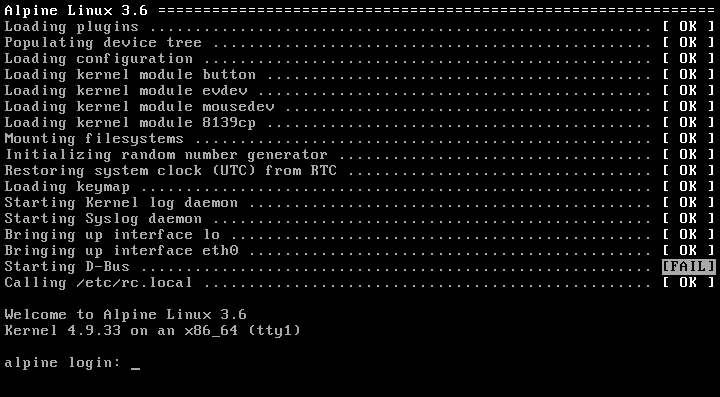

* [Introduction](#introduction)
* [Features](#features)
* [Bootstrap](doc/bootstrap.md#bootstrap)
* [Runlevels](#runlevels)
* [Syntax](doc/config.md#syntax)
  * [Inetd](doc/inetd.md#inetd)
  * [Runparts & /etc/rc.local](#runparts--etcrclocal)
  * [Hooks, Callbacks & Plugins](doc/plugins.md#hooks-callbacks--plugins)
* [Rebooting & Halting](#rebooting--halting)
* [Commands & Status](#commands--status)
* [Building](doc/build.md#building)
  * [Running](doc/build.md#running)
  * [Debugging](doc/build.md#debugging)
* [Requirements](#requirements)
* [Origin & References](#origin--references)


Introduction
------------
[![License Badge][]][License] [![Travis Status]][Travis] [![Coverity Status]][Coverity Scan]

Finit is a simple alternative to [SysV init][4] and [systemd][6].  It
was reverse engineered from the [EeePC fastinit][] ten years ago by
[Claudio Matsuoka][] — "gaps filled with frog DNA …"

Focus is on small and embedded systems, although Finit is fully usable
on server and desktop systems as well.  For working examples, see the
[contrib/](contrib/) section where both [Debian](contrib/debian/) and
up to date [Alpine Linux](contrib/alpine/) tutorials can be found.

  
The screenshot shows [Alpine Linux](https://www.alpinelinux.org/).


Example
-------

This example `/etc/finit.conf` can also be split up in multiple `.conf`
files in `/etc/finit.d`.  Available, but not yet enabled, services can
be placed in `/etc/finit.d/available` and enabled by an operator using
the [initctl](#commands--status) tool.

```ApacheConf
# Fallback if /etc/hostname is missing
host default

# Runlevel to start after bootstrap, 'S', default: 2
runlevel 2

# Services to be monitored and respawned as needed
service [S12345] /sbin/watchdogd -L -f                       -- System watchdog daemon
service [S12345] /sbin/syslogd -n -b 3 -D                    -- System log daemon
service [S12345] /sbin/klogd -n                              -- Kernel log daemon
service   [2345] /sbin/lldpd -d -c -M1 -H0 -i                -- LLDP daemon (IEEE 802.1ab)

# For multiple instances of the same service, add :ID somewhere between
# the service/run/task keyword and the command.
service :1 [2345] /sbin/merecat -n -p 80   /var/www          -- Web server
service :2 [2345] /sbin/merecat -n -p 8080 /var/www          -- Old web server

# Alternative method instead of below runparts, can also use /etc/rc.local
#task [S] /etc/init.d/keyboard-setup start                   -- Setting up preliminary keymap
#task [S] /etc/init.d/acpid start                            -- Starting ACPI Daemon
#task [S] /etc/init.d/kbd start                              -- Preparing console

# Inetd services to start on demand, with alternate ports and filtering
inetd ftp/tcp          nowait [2345] /sbin/in.ftpd           -- FTP daemon
inetd tftp/udp           wait [2345] /sbin/in.tftpd          -- TFTP daemon
inetd time/udp           wait [2345] internal                -- UNIX rdate service
inetd time/tcp         nowait [2345] internal                -- UNIX rdate service
inetd 3737/tcp         nowait [2345] internal.time           -- UNIX rdate service
inetd telnet/tcp       nowait [2345] /sbin/telnetd -i -F     -- Telnet daemon
inetd 2323/tcp         nowait [2345] /sbin/telnetd -i -F     -- Telnet daemon
inetd 222/tcp@eth0     nowait [2345] /sbin/dropbear -i -R -F -- SSH service
inetd ssh/tcp@*,!eth0  nowait [2345] /sbin/dropbear -i -R -F -- SSH service

# Run start scripts from this directory
# runparts /etc/start.d

# Virtual consoles run BusyBox getty
tty [12345] /sbin/getty -L 115200 /dev/tty1 linux
tty [12345] /sbin/getty -L 115200 /dev/tty2 linux
tty [12345] /sbin/getty -L 115200 /dev/tty3 linux

# Use built-in getty for serial port and USB serial
tty [12345] /dev/ttyAMA0 115200 noclear nowait
tty [12345] /dev/ttyUSB0 115200 noclear
```

The `service` stanza, as well as `task`, `run`, `inetd` and others are
described in full in [doc/config.md](doc/config.md).  Here's a quick
overview of some of the most common components needed to start a UNIX
daemon:

```
service [LVLS] <COND> /path/to/daemon ARGS -- Some text
^       ^      ^      ^               ^       ^
|       |      |      |               |        `-- Optional description
|       |      |      |                `---------- Daemon arguments
|       |      |       `-------------------------- Path to daemon
|       |       `--------------------------------- Optional conditions
|        `---------------------------------------- Optional Runlevels
 `------------------------------------------------ Monitored application
```

Some components are optional: runlevel(s), condition(s) and description,
making it easy to create simple start scripts and still possible for more
advanced uses as well:

    service /usr/sbin/sshd -D

Dependencies are handled using [conditions](doc/conditions.md).  One of
the most common conditions is to wait for basic networking to become
available:

    service <net/route/default> /usr/sbin/nginx -- High performace HTTP server

Here is another example where we instruct Finit to not start BusyBox
`ntpd` until `syslogd` has started properly.  Finit waits for `syslogd`
to create its PID file, by default `/var/run/syslogd.pid`.

    service [2345] log <svc/sbin/syslogd> /usr/sbin/ntpd -n -N -p pool.ntp.org
    service [S12345] /sbin/syslogd -n -- Syslog daemon

Notice the `log` keyword, BusyBox `ntpd` uses `stderr` for logging when
run in the foreground.  With `log` Finit redirects `stdout` + `stderr`
to the system log daemon using the command line `logger(1)` tool.

A service, or task, can have multiple dependencies listed.  Here we wait
for *both* `syslogd` to have started and basic networking to be up:

    service [2345] log <svc/sbin/syslogd,net/route/default> /usr/sbin/ntpd -n -N -p pool.ntp.org

If either condition fails, e.g. loss of networking, `ntpd` is stopped
and as soon as it comes back up again `ntpd` is restarted automatically.

**Note:** Make sure daemons *do not* fork and detach themselves from the
  controlling TTY, usually an `-n` or `-f` flag, or `-D` as in the case
  of OpenSSH above.  If it detaches itself, Finit cannot monitor it and
  will instead try to restart it.


Features
--------

**Process Supervision**

Start, monitor and restart services should they fail.


**Inetd**

Finit comes with a built-in [inetd server](doc/inetd.md).  No need to
maintain a separate config file for services that you want to start on
demand.

All inetd services started can be filtered per port and inbound
interface, reducing the need for a full blown firewall.

Built-in optional inetd services:

- echo [RFC862][]
- chargen [RFC864][]
- daytime [RFC867][]
- discard [RFC863][]
- time (rdate) [RFC868][]

For more information, see [doc/inetd.md](doc/inetd.md).


**Getty**

Finit supports external getty but also comes with a limited built-in
Getty, useful for really small systems.  A getty sets up the TTY and
waits for user input before handing over to `/bin/login`, which is
responsible for handling the actual authentication.

```conf
tty [12345] /dev/tty1    38400  nowait  linux
tty [12345] /dev/ttyAMA0 115200 noclear vt100
tty [12345] /sbin/getty  -L 115200 /dev/ttyAMA0 vt100
```

Users of embedded systems may want to enable automatic serial console
with the special `@console` device.  This works regardless weather the
system uses `ttyS0`, `ttyAMA0`, `ttyMXC0`, or anything else.  Finit
figures it out by querying sysfs: `/sys/class/tty/console/active`.

```conf
tty [12345] @console 115200 linux noclear
```

For more information, see [doc/config.md](doc/config.md#syntax).


**Runlevels**

Support for SysV init-style [runlevels][5] is available, in the same
minimal style as everything else in Finit.  The `[2345]` syntax can be
applied to service, task, run, inetd, and TTY stanzas.

All services in runlevel S(1) are started first, followed by the desired
run-time runlevel.  Runlevel S can be started in sequence by using `run
[S] cmd`.  Changing runlevels at runtime is done like any other init,
e.g. <kbd>init 4</kbd>, but also using the more advanced `intictl` tool.


**Plugins**

Plugins can *extend* the functionality of Finit and *hook into* the
different stages of the boot process and at runtime.  Plugins are
written in C and compiled into a dynamic library loaded automatically by
finit at boot.  A basic set of plugins are bundled in the `plugins/`
directory.

Capabilities:

- **Hooks**  
  Hook into the boot at predefined points to extend Finit
- **I/O**  
  Listen to external events and control Finit behavior/services
- **Inetd**  
  Extend Finit with internal inetd services, for an example, see
  `plugins/time.c`

Extensions and functionality not purely related to what an `/sbin/init`
needs to start a system are available as a set of plugins that either
hook into the boot process or respond to various I/O.

For more information, see [doc/plugins.md](doc/plugins.md).


Runparts & /etc/rc.local
------------------------

At the end of the boot, when networking and all services are up, Finit
calls its built-in [run-parts(8)][] on the `runparts <DIR>` directory,
and `/etc/rc.local`, in that order if they exist.

```shell
runparts /etc/rc.d/
```

No configuration stanza in `/etc/finit.conf` is required for `rc.local`.
If it exists and is an executable shell script, finit calls it at the
very end of the boot, before calling the `HOOK_SYSTEM_UP`.  See more on
hooks in [doc/plugins.md](doc/plugins.md#hooks), and about the system
bootstrap in [doc/bootstrap.md](doc/bootstrap.md).


Runlevels
---------

Basic support for [runlevels][5] is included in Finit from v1.8.  By
default all services, tasks, run commands and TTYs listed without a set
of runlevels get a default set `[234]` assigned.  The default runlevel
after boot is 2.

Finit supports runlevels 0-9, and S, with 0 reserved for halt, 6 reboot
and S for services to only run at bootstrap.  Runlevel 1 is the single
user level, where usually no networking is enabled.  In Finit this is
more of a policy for the user to define.  Normally only runlevels 1-6
are used, and even more commonly, only the default runlevel is used.

To specify an allowed set of runlevels for a `service`, `run` command,
`task`, or `tty`, add `[NNN]` to your `/etc/finit.conf`, like this:

```
service [S12345] /sbin/syslogd -n -x     -- System log daemon
run     [S]      /etc/init.d/acpid start -- Starting ACPI Daemon
task    [S]      /etc/init.d/kbd start   -- Preparing console
service [S12345] /sbin/klogd -n -x       -- Kernel log daemon

tty     [12345]  /dev/tty1
tty     [2]      /dev/tty2
tty     [2]      /dev/tty3
tty     [2]      /dev/tty4
tty     [2]      /dev/tty5
tty     [2]      /dev/tty6
```

In this example syslogd is first started, in parallel, and then acpid is
called using a conventional SysV init script.  It is called with the run
command, meaning the following task command to start the kbd script is
not called until the acpid init script has fully completed.  Then the
keyboard setup script is called in parallel with klogd as a monitored
service.

Again, tasks and services are started in parallel, while run commands
are called in the order listed and subsequent commands are not started
until a run command has completed.  Also, task and run commands are run
in a shell, so pipes and redirects can be used.

The following examples illustrate this.  Bootstrap task and run commands
are also removed when they have completed, `initctl show` will not list
them.

```
task [S] echo "foo" | cat >/tmp/bar
run  [S] echo "$HOME" >/tmp/secret
```

Switching between runlevels can be done by calling init with a single
argument, e.g. <kbd>init 5</kbd>, or using `initctl runlevel 5`, both
switch to runlevel 5.  When changing runlevels Finit also automatically
reloads all `.conf` files in the `/etc/finit.d/` directory.  So if you
want to set a new system config, switch to runlevel 1, change all config
files in the system, and touch all `.conf` files in `/etc/finit.d`
before switching back to the previous runlevel again — that way Finit
can both stop old services and start any new ones for you, without
rebooting the system.


Rebooting & Halting
-------------------

Traditionally, rebooting and halting a UNIX system is done by changing
its runlevel.  Finit comes with its own tooling providing: `shutdown`,
`reboot`, `poweroff`, and `suspend`, but also the traditional `init` and
`telinit`, as well as a more modern `initctl` tool, detailed in the next
section.

For compatibility reasons Finit listens to the same set of signals as
BusyBox init.  This is not 100% compatible with SysV init, but clearly
the more common combination for Finit.  For more details, see
[doc/signals.md](doc/signals.md).

Finit also listens to the classic SysV init FIFO, used by `telinit`.
Support for this is implemented by the `initctl.so` plugin.  Hence,
`telinit q` will work as the UNIX beards intended.

```shell
~ # telinit -h
Usage: telinit [OPTIONS] [q | Q | 0-9]

Options:
  -h, --help      This help text
  -V, --version   Show Finit version

Commands:
  0               Power-off the system, same as initctl poweroff
  6               Reboot the system, same as initctl reboot
  2, 3, 4, 5      Change runlevel. Starts services in new runlevel, stops any
                  services in prev. runlevel that are not allowed in new.
  q, Q            Reload *.conf in /etc/finit.d/, same as initctl reload or
                  sending SIGHUP to PID 1
  1, s, S         Enter system rescue mode, runlevel 1
```


Commands & Status
-----------------

Finit also implements a more modern API to query status, and start/stop
services, called `initctl`.  Unlike `telinit` the `initctl` tool does
not return until the given command has fully completed.

```shell
~ $ initctl -h
Usage: initctl [OPTIONS] [COMMAND]

Options:
  -v, --verbose             Verbose output
  -h, --help                This help text

Commands:
  debug                     Toggle Finit (daemon) debug
  help                      This help text
  version                   Show Finit version
  
  list                      List all .conf in /etc/finit.d/
  enable   <CONF>           Enable   .conf in /etc/finit.d/available/
  disable  <CONF>           Disable  .conf in /etc/finit.d/[enabled/]
  touch    <CONF>           Mark     .conf in /etc/finit.d/ for reload
  reload                    Reload  *.conf in /etc/finit.d/ (activates changes)
  
  cond     set   <COND>     Set (assert) condition     => +COND
  cond     clear <COND>     Clear (deassert) condition => -COND
  cond     show             Show condition status
  cond     dump             Dump all conditions and their status
  
  log      [NAME]           Show ten last Finit, or NAME, messages from syslog
  start    <JOB|NAME>[:ID]  Start service by job# or name, with optional ID
  stop     <JOB|NAME>[:ID]  Stop/Pause a running service by job# or name
  restart  <JOB|NAME>[:ID]  Restart (stop/start) service by job# or name
  status | show             Show status of services, default command
  
  runlevel [0-9]            Show or set runlevel: 0 halt, 6 reboot
  reboot                    Reboot system
  halt                      Halt system
  poweroff                  Halt and power off system
  
  utmp     show             Raw dump of UTMP/WTMP db
```

For services *not* supporting `SIGHUP` the `<!>` notation in the .conf
file must be used to tell Finit to stop and start it on `reload` and
`runlevel` changes.  If `<>` holds more [conditions](doc/conditions.md),
these will also affect how a service is maintained.

**Note:** even though it is possible to start services not belonging in
the current runlevel these services will not be respawned automatically
by Finit if they exit (crash).  Hence, if the runlevel is 2, the below
Dropbear SSH service will not be restarted if it is killed or exits.

```shell
~ $ initctl status -v
1       running  476     [S12345]   /sbin/watchdog -T 16 -t 2 -F /dev/watchdog
2       running  477     [S12345]   /sbin/syslogd -n -b 3 -D
3       running  478     [S12345]   /sbin/klogd -n
4:1       inetd  0       [2345]     internal time allow *:37,!eth0
4:2       inetd  0       [2345]     internal time allow eth0:3737
5:1       inetd  0       [2345]     /sbin/telnetd allow *:23 deny eth0,eth1
5:2       inetd  0       [2345]     /sbin/telnetd allow eth0:2323,eth2:2323,eth1:2323
6:1       inetd  0       [345]      /sbin/dropbear allow eth0:222
6:2       inetd  0       [345]      /sbin/dropbear allow *:22 deny eth0
```


Requirements
------------

Finit is capable of running on both desktop/server systems with udev and
embedded systems that usually come with BusyBox mdev.  Some systems have
systemd-udev or eudev today instead of the original udev, Finit probes
for all of them at runtime and expects `/dev/` to be a writable file
system using `devtmpfs`.  It is also possible to run on a statically set
up `/dev` if needed.  It is however not a good idea to have both udev
and mdev installed at the same time, this will lead to unpredictable
results.

At boot Finit calls either `mdev` or `udevd` to populate `/dev`, this is
done slightly differently and on systems with udev you might want to add
the following one-shot task early in your `/etc/finit.conf`:

```conf
run [S] /sbin/udevadm settle --timeout=120 -- Waiting for udev
```

Finit has a built-in Getty for TTYs, but requires a working `/bin/login`
or `/bin/sh`, if no TTYs are configured in `/etc/finit.conf`.

For a fully operational system `/var`, `/run` and `/tmp` must be set up
properly in `/etc/fstab` -- which is iterated over at boot.

The built-in Inetd requires `/etc/services` and `/etc/protocols` to work
with port names rather than numbers.


Origin & References
-------------------

This project is based on the [original finit][] by [Claudio Matsuoka][]
which was reverse engineered from syscalls of the [EeePC fastinit][] —
"gaps filled with frog DNA …"

Finit is developed and maintained by [Joachim Nilsson][] at [GitHub][].
Please file bug reports, clone it, or send pull requests for bug fixes
and proposed extensions.


[1]:  https://en.wikipedia.org/wiki/Process_supervision
[2]:  http://cr.yp.to/daemontools.html
[3]:  http://smarden.org/runit/
[4]:  http://en.wikipedia.org/wiki/Init
[5]:  http://en.wikipedia.org/wiki/Runlevel
[6]:  https://www.freedesktop.org/wiki/Software/systemd/
[9]:  https://github.com/troglobit/troglos
[RFC862]:           https://tools.ietf.org/html/rfc862
[RFC863]:           https://tools.ietf.org/html/rfc863
[RFC864]:           https://tools.ietf.org/html/rfc864
[RFC867]:           https://tools.ietf.org/html/rfc867
[RFC868]:           https://tools.ietf.org/html/rfc868
[init]:             http://en.wikipedia.org/wiki/Init
[upstart]:          http://upstart.ubuntu.com/
[systemd]:          http://www.freedesktop.org/wiki/Software/systemd/
[openrc]:           http://www.gentoo.org/proj/en/base/openrc/
[run-parts(8)]:     http://manpages.debian.org/cgi-bin/man.cgi?query=run-parts
[original finit]:   http://helllabs.org/finit/
[EeePC fastinit]:   http://wiki.eeeuser.com/boot_process:the_boot_process
[Claudio Matsuoka]: https://github.com/cmatsuoka
[Joachim Nilsson]:  http://troglobit.com
[GitHub]:           https://github.com/troglobit/finit
[License]:          https://en.wikipedia.org/wiki/MIT_License
[License Badge]:    https://img.shields.io/badge/License-MIT-yellow.svg
[Travis]:           https://travis-ci.org/troglobit/finit
[Travis Status]:    https://travis-ci.org/troglobit/finit.png?branch=master
[Coverity Scan]:    https://scan.coverity.com/projects/3545
[Coverity Status]:  https://scan.coverity.com/projects/3545/badge.svg
