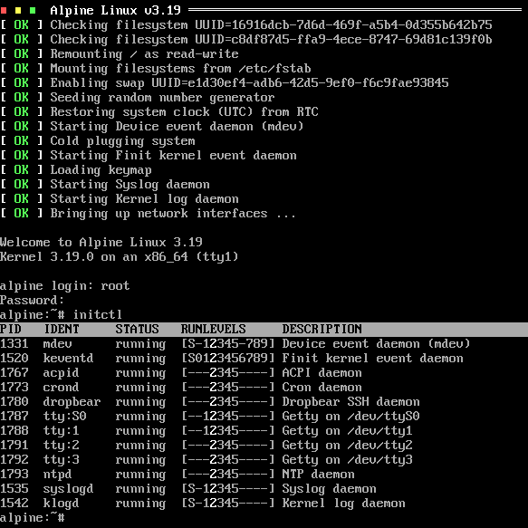

[![License Badge][]][License] [![GitHub Status][]][GitHub] [![Coverity Status][]][Coverity Scan]

Finit is an alternative to [SysV init](https://en.wikipedia.org/wiki/Init)
and [systemd](https://www.freedesktop.org/wiki/Software/systemd/), focused
on small and embedded Linux systems, although fully usable on server and
[desktop systems][finix].

> Reverse engineered from the [EeePC fastinit][]  
> "gaps filled with frog DNA …"  
> — [Claudio Matsuoka][]

For detailed information, explore our extensive documentation  
:books: **<https://troglobit.github.io/finit/>**

   

For working examples, see the :rocket: [contrib/](contrib/) section or these
tutorials:

  * :hammer_and_wrench: [Buildroot embedded Linux](https://troglobit.com/post/2022-12-26-buildroot-demo-of-fastinit-finit/),
  * :package: [Debian GNU/Linux](contrib/debian/),
  * :mountain: [Alpine Linux](contrib/alpine/), and
  * :milky_way: [Void Linux](contrib/void/)

> [!NOTE]
> Support for various Linux distributions does not mean Finit installs
> easily on all architectures.  Bundled install scripts are examples for
> standard installations, tested on amd64 (x86_64) systems.  Custom
> setups, e.g., for embedded systems, can be found in the following
> [Buildroot][] based examples: [myLinux][], [Infix][], or the plain
> [br2-finit-demo](https://github.com/troglobit/br2-finit-demo).

[finix]:            https://github.com/aanderse/finix
[Buildroot]:        https://buildroot.org
[Infix]:            https://kernelkit.github.io
[myLinux]:          https://github.com/troglobit/myLinux/
[EeePC fastinit]:   https://web.archive.org/web/20071208212450/http://wiki.eeeuser.com/boot_process:the_boot_process
[Claudio Matsuoka]: https://github.com/cmatsuoka
[License]:          https://en.wikipedia.org/wiki/MIT_License
[License Badge]:    https://img.shields.io/badge/License-MIT-teal.svg
[GitHub]:           https://github.com/troglobit/finit/actions/workflows/build.yml/
[GitHub Status]:    https://github.com/troglobit/finit/actions/workflows/build.yml/badge.svg
[Coverity Scan]:    https://scan.coverity.com/projects/3545
[Coverity Status]:  https://scan.coverity.com/projects/3545/badge.svg
