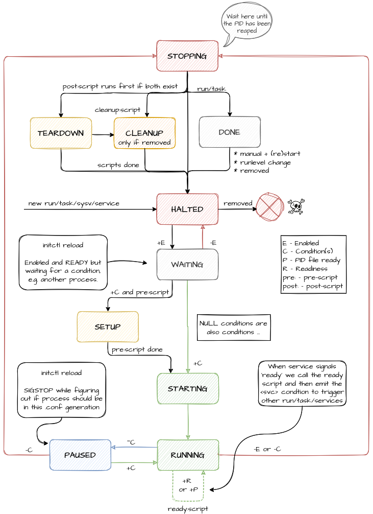

Finit Conditions
================



* [Introduction](#introduction)
* [Triggering](#triggering)
* [Built-in Conditions](#built-in--conditions)
* [Debugging](#debugging)
* [Internals](#internals)


Introduction
------------

Conditions are a new addition to Finit, introduced in v3, with the
intention of providing a mechanism for common synchronization problems.
For example:

- *"wait for service A to start before starting service B"*, or
- *"wait for basic network access to be available"*

Conditions are similar in syntax to declaring runlevels per service.
They are specified within angle brackets `<>` and can be applied to any
of the `service`, `task`, or `run` stanza.  Multiple conditions may be
specified separated by comma.  Multiple conditions are logically AND'ed
during evaluation, i.e. all conditions must be satisfied in order for a
service to run.


### Example

    service [2345] <pid/setupd,pid/zebra> /sbin/netd -- Network monitor

In this example the Network monitor daemon `netd` is not started until
both the `pid/setupd` *and* `pid/zebra` conditions are satisfied.  A
`pid/` condition is satisfied by the corresponding service's PID file
being created.

**NOTE:** Conditions also stop services when a condition is no longer
  asserted.  I.e., if the Zebra process above stops or restarts, netd
  will also stop or restart.


Triggering
----------

Conditions are mainly triggered (asserted) by built-in plugins, e.g.,

  - `netlink.so`: provides `<net/...>`
  - `pidfile.so`: provides `<pid/...>`
  - Cmdline `finit.cond=arg`: provides `<boot/arg`

See below for built-in conditions.  Finit also supports user-defined
conditions, sometimes referred to as static or one-shot conditions.
They live in the `<usr/...` namespace and are constrained to a flat
hierarchy without any sub-directories, unlike the pidfile plugin, for
instance.

User-defined conditions are controlled using the `initctl cond set` and
`initctl cond clear` commands:

    initctl cond set foo
    initctl cond clear foo

The purpose of user-defined conditions is to be able to start or stop
services, or run/task jobs, on external site-dependent stimuli.
Example:

    service [2345] <usr/foo> alarm --arg foo -- Foo alarm

For convenience, prefixing with `usr/` is allowed, but any other slashes
or period characters are disallowed.  E.g., to trigger the `Foo alarm`,
the same as above, can also be achieved like this:

    initctl cond set usr/foo
    initctl cond clear usr/foo

Conditions retain their current state until the next reconfiguration or
runlevel change.  At that point all set conditions transition into the
`flux` state, meaning the condition's state is unknown.  (For more info
on this, see [Internals](#internals).)  Thus, after a reconfiguration it
is up to the "owner" of the condition to convey the new (or possibly
unchanged) state of it.

> **Note:** For `pid/` conditions it is expected that services "touch"
>           or recreate their PID file on `SIGHUP`.

Static (one-shot) conditions, like `usr/`, never enter the `flux` state.


Built-in Conditions
-------------------

Finit comes with a set of plugins for conditions: `pidfile`, `netlink`,
`sys`, and `usr`.  The `pidfile` plugin (recursively) watches `/run/`
(recursively) for PID files created by the monitored services, and sets
a corresponding condition in the `pid/` namespace.  Similarly, the
`netlink` plugin provides basic conditions for when an interface is
brought up/down and when a default route (gateway) is set, in the `net/`
namespace.  The `sys` and `usr` plugins monitor are passive condition
monitors where the action is provided by `keventd`, signal handlers,
and in the case of `usr`, the end-user via the `initctl` tool

With the example listed above, finit does not start the `/sbin/netd`
daemon until `setupd` and `zebra` has started *and* created their PID
files.  Which they do when they have completed their initial set up and
are ready to receive signals.

Finit expects monitored services to touch their PID files, i.e. update
the mtime, when they reload their configuration files after a `SIGHUP`.
Some services do not support `SIGHUP` and are instead restarted, which
is a crude but effective way to have the PID file touched (re-created).

Built-in conditions:

- `pid/<SERVICE>`
- `net/route/default`
- `net/<IFNAME>/exist`
- `net/<IFNAME>/up`
- `net/<IFNAME>/running`
- `sys/pwr/ac`
- `sys/pwr/fail`
- `sys/key/ctrlaltdel`
- `usr/foo`
- `boot/arg`

**Note:** `up` means administratively up, the interface flag `IFF_UP`.
  `running` is the `IFF_RUNNING` flag, meaning operatively up.  The
  difference is that `running` tells if the NIC has link.


Composition
-----------

The `pid/` conditions are generated by the Finit `pidfile.so` plugin and
composed from a service's `name:` and `:id`.  By default the basename of
the daemon and the empty string.

| **service**                                        | **condition**    |
|----------------------------------------------------|------------------|
| /sbin/foo                                          | pid/foo          |
| /sbin/bar -p /run/baz.pid                          | pid/bar          |
| name:lxc :foo lxc-start -n foo -p /run/lxc/foo.pid | pid/lxc:foo      |
| /usr/bin/dbus-daemon                               | pid/dbus-daemon  |
| :222 dropbear -p 222                               | pid/dropbear:222 |

The condition is asserted when `pidfile.so` receives an inotify event
for a file matching `/run/*.pid`, `/run/**/*.pid`, or `/run/**/pid`,
which contains the PID of the service Finit has started.

When Finit configuration files are changed and the `initctl reload`
command is called, it is expected of services to touch their PID files
for Finit to reassert their conditions.

Daemons that don't create PID files, or fail to touch them on reload,
can be worked around by using the `pid:/path/to/file.pid` syntax in
the service stanza for the daemon.  It is far from optimal since any
synchronization of depending services may fail due to the daemon not
having reinitialized/created their IPC sockets, or similar.

> **Note:** in versions of Finit prior to v4, the PID conditions were
>           called 'svc' conditions, and they were far more complex.


Debugging
---------

If a service is not being started as it should, the problem might be
that one of its conditions is not in the expected state.  Use the
command `initctl status` to inspect service status.  Services in the
`ready` state are pending a condition.

In that situation, running `initctl cond show` reveals which of the
conditions that are not satisfied.  Listed as `off` below.

**Example:**

```shell
~ # initctl cond show
PID     IDENT         STATUS  CONDITION (+ ON, ~ FLUX, - OFF)
=======================================================================
1419    /sbin/netd    on      <+pid/setupd,+pid/zebra>
0       /sbin/udhcpc  off     <-net/vlan1/exist>
```

Here we can see that `netd` is allowed to run since both its conditions
are in the `on` state, as indicated by the `+`-prefix.  `udhcpc` however
is not allowed to run since `net/vlan1/exist` condition is not satisfied.
As indicated by the `-`-prefix.

To fake interface `vlan1` suddenly appearing, and test what happens to
`udhcpc` we can enable debug mode and assert the condition, like this:

```shell
~ # initctl debug
~ # mkdir -p /var/run/finit/cond/net/vlan1
~ # cp /var/run/finit/cond /var/run/finit/cond/net/vlan1/exist
```

Then watch the console for the debug messages and then check the output
from `initctl cond show` again.  The client will likely have failed to
start, but at least the condition is now satisfied.

There is also the `initctl cond dump` command, which dumps all known
conditions, their current status, and their origin.


Internals
---------

As shown previously, conditions are implemented as simple files in the
file system, in the `/var/run/finit/cond/` sub-directory.  The files
are created, updated, and removed by condition plugins.  To debug them,
see the previous section.

A condition is always in one of three states:

* `  on` (+): The condition is asserted.
* ` off` (-): The condition is deasserted.
* `flux` (~): The conditions state is unknown.

All conditions that have not explicitly been set are interpreted as
being in the `off` state.

When a reconfiguration is requested, Finit transitions all conditions to
the `flux` state.  As a result, services that depend on a condition are
sent `SIGSTOP`.  Once the new state of the condition is asserted, the
service receives `SIGCONT`.  If the condition is no longer satisfied the
service will then be stopped, otherwise no further action is taken.

This STOP/CONT handling minimizes the number of unnecessary service
restarts that would otherwise occur because a depending service was sent
`SIGHUP` for example.

Therefore, any plugin that supplies Finit with conditions must ensure
that their state is updated after each reconfiguration.  This can be
done by binding to the `HOOK_SVC_RECONF` hook.  For an example of how
to do this, see `plugins/pidfile.c`.
