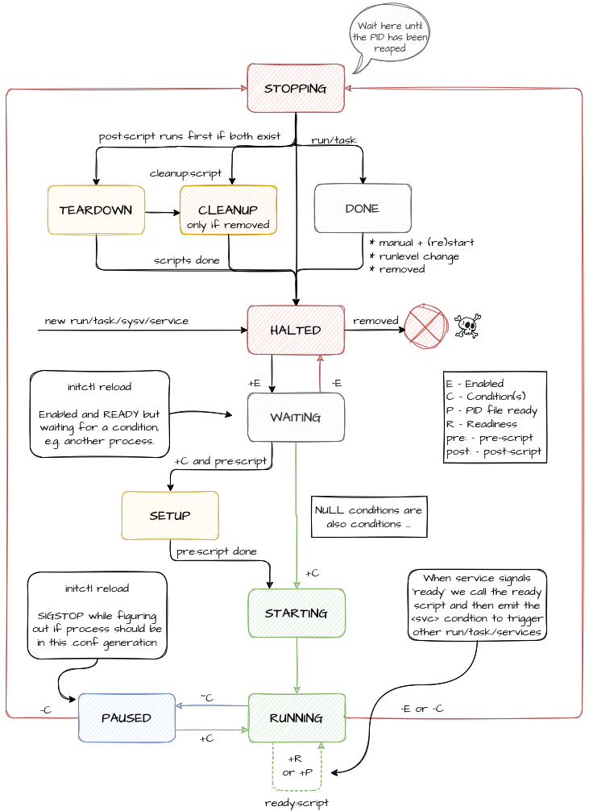

State Machine
=============

A service is bound to a state machine that is in one of ten states.  For
run/tasks there is an additional end state called `DONE`.  All processes
managed by Finit start in the `HALTED` state.  The image shows how both
conditions and commands drive the machine.

The current state depends on the two following conditions:

* `E`: Service enabled. In order for `E` to be satisfied, the service
  must be allowed to run in the current runlevel and not be stopped.
  
  A service may be stopped, or blocked, for several reasons:

  - The user has manually stopped the service using `initctl stop NAME`
  - The program exits immediately. I.e. keeps crashing (make sure to use
    the 'run this service in the foreground' command line option)
  - The binary is missing in the filesystem

* `C`: Service conditions are satisfied:

  - `on` (+): The condition is asserted.
  - `off` (-): The condition is deasserted.
  - `flux` (~): The condition state is unknown.

For a detailed description of conditions, and how to debug them,
see the [Finit Conditions](conditions.md) document.
